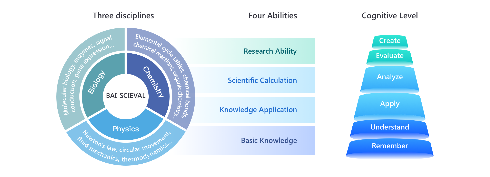

<center><font size=20><strong>BAI-<font color="#80F6FF">Sci</font>Eval</strong></font></center>

<p align="center">
   <font size=50>BAI-SciEval</font>
</p>

<p align="center">
   🌐 <a href="https://bai-scieval.duiopen.com/#/" target="_blank">Website</a> • 🤗 <a href="https://huggingface.co/datasets/OpenDFM/BAI-SciEval" target="_blank">Hugging Face</a>
</p>


## Description
BAI-SCIEVAL is an evaluation benchmark for large language models in the scientific domain. It consists of approximately 18,000 objective evaluation questions and few subjective questions, covering the fundamental scientific fields of chemistry, physics, and biology. This benchmark assesses the understanding and generation capabilities of large language models in scientific content from four aspects: basic knowledge, knowledge application, scientific calculation, and research ability.



## Files Description

* *bai-scieval-dev.json* is the dev set, containing 5 samples for each $task\ name$, each $ability$ and each $category$, which is specially used for few shot.
* *bai-scieval-valid.json* is the valid set, containing the answer for each question.
* *bai-scieval-test.json* is the test set.
* *make_few_shot.py* is the code for generating the few shot data, you can modify it as you need.
* *eval.py* is the evaluation code for the valid set, which is the same as the one we used for the test set. Note the the prediction should follow the format:
```
[{
    "id": "5534a4ef45aea8a6f1835750a54c01d0",
    "pred": "C",
}]
```
* *dynamic_chem.json* and *dynamic_phy.json* is the dynamic data, which is a re-generated version and is different from the data we used in the leaderboard. We will update it regularly.
* *eval_dynamic.py* is the evalution code for the dynamic data. To use this script, you need to add *"pred"* key directly to the original dynamic data.
